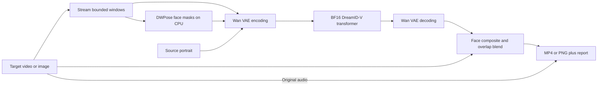

# Architecture and validation

The pretrained DreamID-V Faster network uses the Wan video diffusion architecture:
30 transformer blocks, hidden width 1536, 12 attention heads, and FFN width 8960.
The input has 48 channels: 16 noisy latent channels, 16 target-video latent channels,
and 16 face-mask latent channels. The reference identity image is encoded with the
same VAE and projected into additional spatial tokens. Text conditioning uses the
fixed upstream context tensor; no multi-billion-parameter T5 encoder is needed at
runtime. Sampling uses the upstream flow-matching UniPC scheduler.

## Changes from upstream inference

The network, VAE, DWPose ONNX inference helpers, and scheduler are vendored from
commit `9b589940577559c91481fb3a13bae000a55f97a1`. Their original files and checksums
are recorded in `src/deepfakeheretic/_vendor/ORIGIN.json`. The new runtime replaces
the upstream orchestration rather than relying on a mutable external checkout.

- CPU checkpoint loading with `weights_only=True`, `mmap=True`, and strict state
  dictionary validation; no missing/unexpected parameters accepted.
- BF16 storage for large transformer weights and the VAE. Time embedding,
  time projection, output head, and affine LayerNorms retain FP32 where required
  by upstream forward operations.
- PyTorch SDPA adapter supporting ragged lengths, explicit attention scaling, and
  the upstream tensor layout. CUDA selects flash or memory-efficient attention
  and refuses a quadratic math fallback. CPU math remains available for tests.
- Offload entire stages between VAE encoding, transformer sampling, and VAE
  decoding. No simultaneous residency of both large components.
- Read at most one context window plus one lookahead frame from the source.
  Working RAM scales with window size and source resolution, not movie duration.
- Repeat-pad tails to `4n+1`, minimum five frames, then trim generation back to
  the actual input length. Still-image input uses this same padding path.
- Serial guidance passes reproduce upstream's formula
  `positive + guidance * (positive - negative)`.
- Cache face masks for overlap frames; blend overlap outputs using a linear ramp.
- Use a temporary output directory and publish finished media only after
  generation, encoding, and audio muxing succeed.

No training implementation, new learned weights, face-restoration network,
quantization calibration, optical-flow stabilization, or identity tracking is
implied by this integration. Those require separate datasets and validation.

## Hardware acceptance procedure

1. On the 4090, install and run `heretic download` and `heretic doctor --verify`.
2. Run `heretic benchmark --preset 4090 --output outputs/4090-benchmark.json`.
   This executes a complete 33-frame diffusion window with the actual weights.
3. Record the benchmark's GPU name, versions, allocator budget, memory peaks,
   load time, and inference time. Also observe `nvidia-smi` to account for memory
   outside PyTorch. An allocator limit alone is not proof of hardware fit.
4. Run short, permissioned portrait clips: frontal, profile, glasses, hand
   occlusion, large expression changes, and a clip longer than two windows.
   Check likeness, expression, boundaries, flicker, frame count, and audio sync.
5. Test PNG mode separately. A passing video run does not establish image quality.
6. If memory is insufficient, repeat with `low-memory`; record that preset rather
   than reporting the default as verified. Benchmark `720p` independently.

The current local environment is macOS without NVIDIA CUDA, so GPU performance
claims must remain pending. See `docs/validation.md` for the actual local results.

